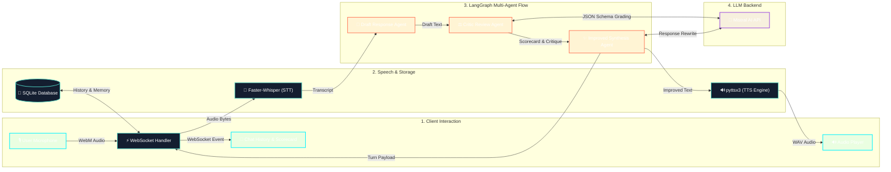

# VoxLoop 🎙️⚡

> **An In-Flight Multi-Agent Critique & Self-Correction Voice Engine for Support Quality Assurance**

VoxLoop is a real-time, multi-agent voice assistant platform powered by **FastAPI**, **WebSockets**, **LangGraph**, **LangChain**, and **Mistral AI**. It transcribes spoken input locally, drafts a response, evaluates it against a secondary critic agent across 6 compliance and empathy dimensions, automatically rewrites the response using feedback and multi-turn session memory, and synthesizes the finalized audio back to the client.

---

## 🌟 Key Features

* 🎙️ **Real-Time Voice Streaming**: Browser speech capture over WebSockets with live stage status tracking (`STT` ➔ `Agent Loop` ➔ `TTS`).
* 🧠 **Multi-Agent Self-Correction Graph**: Powered by **LangGraph**, routing state through three discrete nodes: `draft_response` ➔ `critique_response` ➔ `improve_response`.
* 📊 **6-Metric Compliance & Quality Scorecard**: Evaluates responses for **Accuracy**, **Relevance**, **Empathy**, **Clarity**, **Policy Compliance**, and **Overall Quality** (0–100 score).
* 💬 **Right-Side Chat History Panel**: Displays all prior interaction turns as styled chat bubbles with user sentiment and emotional state badges.
* 🔄 **Persistent Multi-Turn Session Memory & Reset**: Maintains dialogue continuity across multiple turns, with a `Reset Session` trigger to wipe memory and open a new session.
* ⚡ **Local Edge Voice Models**: Offline Speech-to-Text via `faster-whisper` (CTranslate2 INT8 with VAD) and offline Text-to-Speech via `pyttsx3`.
* 🐳 **Containerized & Cloud Ready**: Fully containerized with `Dockerfile`s and `docker-compose.yml` for local execution or instant cloud server deployment (Oracle Cloud, DigitalOcean, AWS).

---

## 🏗️ Architecture & Data Flow




---

## 🛠️ Tech Stack

| Component | Technology | Description |
| :--- | :--- | :--- |
| **Frontend** | Next.js 15, React 19, CSS Glassmorphism | Dual-column responsive layout, live audio capture, score progress bars |
| **Backend** | FastAPI, Uvicorn, WebSockets | Asynchronous event loop, real-time WebSocket communication |
| **Orchestration** | LangGraph, LangChain | State-graph multi-agent workflow execution |
| **LLMs** | Mistral AI (`mistral-small-latest`) | Primary generation and structured output evaluation |
| **Speech-to-Text** | `faster-whisper` | Fast local CTranslate2 Whisper model (CPU/INT8 with VAD) |
| **Text-to-Speech** | `pyttsx3` | Offline cross-platform SAPI / espeak voice synthesis engine |
| **Database** | SQLite + SQLAlchemy ORM | Long-term session runs and conversation history memory |
| **Deployment** | Docker, Docker Compose, Nginx | Multi-stage container builds and production HTTPS proxy |

---

## 🚀 Quickstart Guide

### Option A: Running with Docker Compose (Recommended)

1. **Clone the repository**:
   ```bash
   git clone https://github.com/Trijalluhariwala/voxloop.git
   cd voxloop
   ```

2. **Set up Environment File**:
   Create `backend/.env`:
   ```env
   MISTRAL_API_KEY_PRIMARY=your_mistral_primary_key_here
   MISTRAL_API_KEY_CRITIC=your_mistral_critic_key_here
   MISTRAL_MODEL_PRIMARY=mistral-small-latest
   MISTRAL_MODEL_CRITIC=mistral-small-latest
   DATABASE_URL=sqlite:///./data/voxloop.db
   WHISPER_MODEL_SIZE=base
   WHISPER_DEVICE=cpu
   WHISPER_COMPUTE_TYPE=int8
   ```

3. **Launch Containers**:
   ```bash
   docker-compose up -d --build
   ```
   * Frontend available at `http://localhost:3000`
   * Backend API available at `http://localhost:8000`

---

### Option B: Local Manual Development Setup

#### Backend Setup
```bash
cd backend
python -m venv .venv

# On Windows:
.venv\Scripts\activate
# On Linux/macOS:
source .venv/bin/activate

pip install -r requirements.txt
cp .env.example .env   # Add your Mistral API keys in .env
uvicorn app.main:app --reload
```

#### Frontend Setup
```bash
cd frontend
npm install
npm run dev
```

---

## 📡 API & WebSocket Reference

### Endpoints

* **`GET /health`**: Health check returning `{"status": "ok"}`.
* **`POST /api/reset-session`**: Deletes all database records for a given `session_id` to start a fresh chat.
* **`GET /api/session/{session_id}/history`**: Fetches past conversation memory items for a session.
* **`POST /api/voice-turn`**: REST fallback for single voice turn processing.
* **`WS /ws/voice-turn`**: Primary real-time WebSocket connection for streaming audio chunks and receiving progress events (`stt` ➔ `llm` ➔ `tts` ➔ `result`).

---

## 🎯 Architectural Insights & Deep Dive

### 01. Why VoxLoop is Unique
VoxLoop is not a simple "voice-in, LLM-out" wrapper. It implements an **in-flight multi-agent self-correction feedback loop**. It processes speech locally on the edge, drafts an initial response, grades it against a secondary critic model across 6 compliance dimensions, rewrites the response seamlessly incorporating recommendations, and streams the refined response back to the user.

### 02. Target Audience & Problem Solved
* **Target Persona**: **Customer Support Quality Assurance (QA) Auditors & Trainees** *(e.g., Sarah Jenkins, QA Lead at a FinTech Call Center overseeing 50 support reps)*.
* **The Problem**: Support agents often give answers that are technically correct but fail on **empathy, clarity, or strict regulatory policy compliance**. QA auditors currently spend 20+ hours a week manually listening to past call recordings post-mortem to fill out evaluation forms.
* **The Solution**: VoxLoop acts as a **live critique & coaching copilot**, automatically scoring calls in real time and demonstrating the exact improved phrasing that should have been spoken.

### 03. The Non-Obvious Hard Part
* **Stateful Multi-Turn Memory Isolation**: In a multi-turn conversation, passing raw Critic JSON objects into subsequent turns causes the LLM to hallucinate meta-critiques in future responses (*"As a critic agent, I scored myself 85..."*). 
* **Solution**: VoxLoop enforces strict memory isolation in SQLite (`ConversationRun`). Only the **Human Utterance** and the **Final Improved Agent Response** are committed to long-term conversation history, while critique scores remain isolated to the active turn evaluation graph.

### 04. Scalability at 10,000 Concurrent Users
* **Inference Offloading**: Transition `faster-whisper` and `pyttsx3` from local CPU threads to a distributed worker pool (Celery / Ray on GPU clusters) or streaming cloud APIs (Deepgram / AssemblyAI).
* **Database Scaling**: Migrate SQLite to PostgreSQL / AWS Aurora with Redis connection pooling for session caching.
* **Horizontal Gateway Scaling**: Scale FastAPI instances horizontally behind an Nginx load balancer using a Redis Pub/Sub WebSocket backplane.

---

## 📄 License

Distributed under the MIT License. See `LICENSE` for details.
